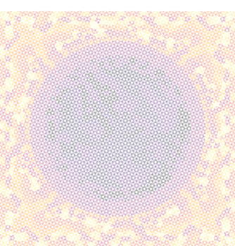

<h2 align="center">⚡⚡ArcProject⚡⚡</h2>

<h2 align="center">PIN-CELL</h2>
 
The first reactor I will simulate is a pin cell reactor, the smallest unit of a nuclear reactor, in this case I will use scripts from Julia to modelling a neutron transport phenomenon for the control volume. 
Where I defined the number of azimutal angles (nφ) as 32, the azimutal spacing (δ) as 0.001, the boundary conditions as reflective and with these conditions will be setted into the TrackGenerator() method to generate the Tracks:
  

A variable called "tr" will get the method TrackGenerator() to proceed the segmentation with the function segmentize!(tg):

  
  

  
 After doing this, the next step is setting the variables for the reactor material the pin-fuel, water for cooling and the cladding:
  
 
PIN
  
    νΣf = [1.86278e-2, 3.44137e-1]
     
    Σt  = [3.62022e-1, 5.72155e-1]
     
    Σs0 = [3.33748e-1  6.64881e-4; 0.0e-0 3.80898e-1]
     

     
CLADDING
   
    Σt  = [2.74144e-1, 2.80890e-1]
     
    Σs0 = [2.72377e-1 1.90838e-4; 0.0e-0 2.77230e-1]
 

 
WATER
   
Σt  = [6.40711e-1, 1.69131e-0]
     
    Σs0 = [6.07382e-1 3.31316e-2; 0.0e-0 1.68428e-0]

 
With the material variables defined the next step is to use the solve method and write a vtk type of file, a typical one for simulated geometries. 
