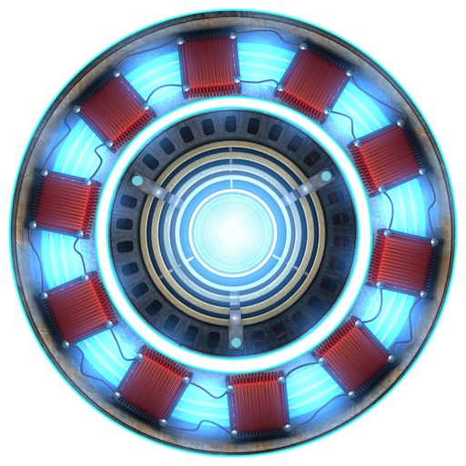

<h2 align="center">ArcProject</h2>
 

 
 
<h2 align="center">PIN-CELL</h2>
 
The first reactor I will simulate will be a pin cell reactor, the smallest unit of a reactor, in this case I will use scripts from Julia to modelling a neutron trnasport for the control volume. 
Where I defined the number of azimutal angles (nφ) as 32, the azimutal spacing (δ) as 0.001, the boundary conditions as reflective and with these conditions will be setted into the TrackGenerator() method to generate the Tracks:
  

